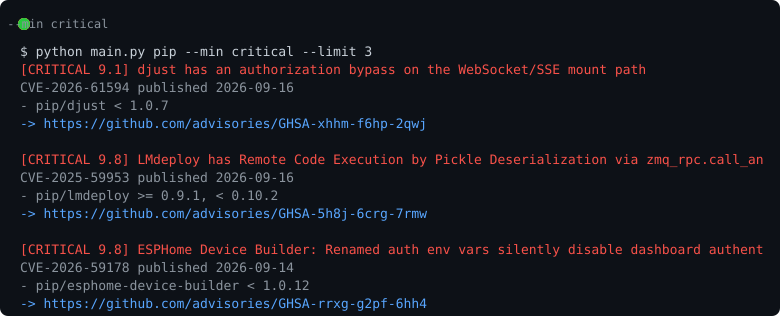

# cvedigest

Свежие security advisory из GitHub Advisory Database прямо в терминал, без
браузера и дашбордов.

## Зачем

Каждое утро смотреть что нового прилетело в твоём стеке — полезная привычка,
но ходить по сайтам лень. Эта штука делает один запрос к GitHub Advisory API
и рисует краткий дайджест.

## Использование

```bash
python3 main.py pip                # свежий pip-малварь
python3 main.py npm --min high     # только high и critical
python3 main.py go --limit 5
python3 main.py --digest weekly    # неделя markdown-таблицей
python3 main.py --min high --kev   # только то что в CISA KEV (реально эксплуатируют)
```

Экосистемы — те же, что в GitHub: pip, npm, go, maven, rubygems, cargo...

## Как выглядит



Про `--kev`: тянет список CISA Known Exploited Vulnerabilities и показывает
только совпавшее. Нюанс — в KEV попадают с задержкой, так что со свежими
неделями список часто пустой. Это не баг, это суровая правда про exploit-ветку.

## Пример вывода

```
[CRITICAL] Remote code execution in jinja2
  GHSA-xxxx-xxxx-xxxx  published 2026-09-10
  - pip/jinja2 < 3.1.4
```

## Пример работы как есть (v0.1)

- читает /advisories у api.github.com (анонимно, 60 req/h хватит с головой)
- фильтр --min работает как "не ниже", т.к. API отдаёт только точную severity

## TODO

- [ ] markdown-дайджест за неделю (для телеграм-канала потом)
- [ ] cvss score в выводе
- [ ] кэш, чтобы не дёргать api каждый раз
